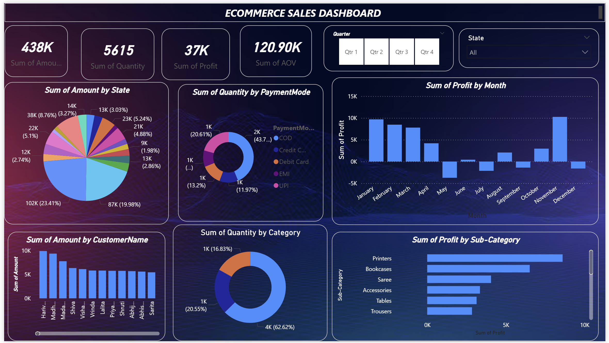

# 🛒 Ecommerce Sales Dashboard | Power BI

## 📌 Project Overview

This project is an **Interactive Ecommerce Sales Dashboard** built using **Microsoft Power BI**. The dashboard provides insights into sales performance, profit, customer purchasing behavior, payment methods, product categories, and regional sales trends. It helps businesses monitor key performance indicators (KPIs) and make data-driven decisions.

---

## 🚀 Features

* 📈 Interactive and dynamic dashboard
* 💰 Total Sales (Amount) analysis
* 📊 Total Profit tracking
* 📦 Quantity Sold analysis
* 🛍️ Average Order Value (AOV)
* 🌍 State-wise Sales Distribution
* 💳 Payment Mode Analysis
* 🏷️ Category-wise Sales Breakdown
* 📉 Profit by Sub-Category
* 👥 Top Customers by Sales
* 📅 Quarter-wise filtering
* 📍 State-wise filtering using slicers

---

## 📊 Dashboard KPIs

The dashboard includes the following key metrics:

* **Total Sales Amount**
* **Total Profit**
* **Total Quantity Sold**
* **Average Order Value (AOV)**

---

## 📈 Visualizations Used

* KPI Cards
* Pie Chart
* Donut Charts
* Bar Chart
* Column Charts
* Interactive Slicers
* Filters

---

## 🛠️ Tools & Technologies

* **Microsoft Power BI**
* Data Modeling
* Power Query
* DAX
* Interactive Visualizations

---

## 📂 Dataset

The dashboard is built using an Ecommerce Sales dataset containing information such as:

* Customer Details
* Order Information
* Product Categories
* Sub-Categories
* Sales Amount
* Profit
* Quantity
* Payment Mode
* State
* Order Date

---

## 📷 Dashboard Preview

images/dashboard.png

---

## 📌 Business Insights

* Identify high-performing states based on sales.
* Analyze the most preferred payment methods.
* Track category-wise and sub-category-wise performance.
* Discover top customers contributing to revenue.
* Monitor quarterly sales and profit trends.
* Evaluate overall business performance through KPI cards.

---

---

## 🎯 Skills Demonstrated

* Data Cleaning
* Data Modeling
* DAX Measures
* Dashboard Design
* Business Intelligence
* Data Visualization
* KPI Reporting
* Interactive Reporting

---

## 👨‍💻 Author

**Saurabh Bagul**

---

